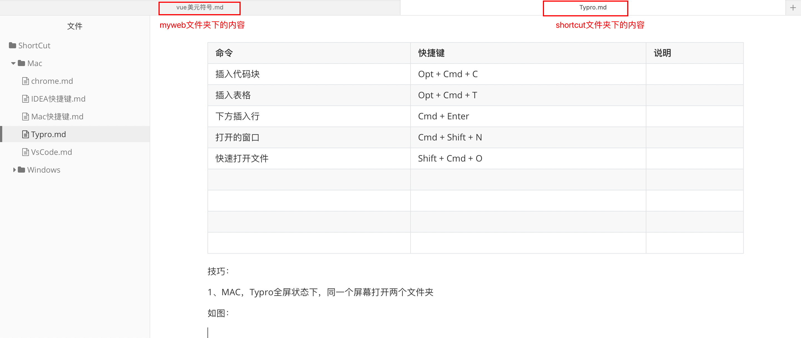

# Typro快捷键

| 命令         | 快捷键          | 说明 |
| ------------ | --------------- | ---- |
| 打开的窗口   | Cmd + Shift + N |      |
| 快速打开文件 | Shift + Cmd + O |      |
| 插入超链接   | Cmd + K         |      |
|              |                 |      |

## 编辑

| 命令 | 快捷键        | 说明 |
| ---- | ------------- | ---- |
| 替换 | Opt + Cmd + F |      |

## 段落

| 命令          | 快捷键        | 说明         |
| ------------- | ------------- | ------------ |
| 插入代码块    | Opt + Cmd + C |              |
| 公式块        | Opt + Cmd + B |              |
| 无序列表      | Opt + Cmd + U |              |
| 有序列表      | Opt + Cmd + O |              |
| 任务列表      | Opt + Cmd + X | 前面有个框框 |
| 列表 增加缩进 | Cmd + ]       |              |
| 列表 减少缩进 | Cmd + [       |              |
| 引用          | Opt + Cmd + Q |              |

## 搜索

| 命令         | 快捷键          | 说明 |
| ------------ | --------------- | ---- |
| 按文件名搜索 | Shift + cmd + F |      |

## 表格

| 命令         | 快捷键               | 说明 |
| ------------ | -------------------- | ---- |
| 插入表格     | Opt + Cmd + T        |      |
| 在下方插入行 | cmd + enter          |      |
| 删除行       | shift + cmd + delete |      |
| 行列的移动   | Ctl + Cmd + 四个箭头 |      |

## 显示

| 命令            | 快捷键            | 说明             |
| --------------- | ----------------- | ---------------- |
| 大纲视图        | control + cmd + 1 | 查看文本目录结构 |
| 文件树          | control + cmd + 3 |                  |
| 显示/隐藏侧边栏 | shift + cmd + L   |                  |
|                 |                   |                  |

## 技巧：

1、MAC，Typro全屏状态下，同一个屏幕打开两个文件夹

如图：

方法：

1. 点击右上角的加号
2. 点击左下角的文件夹，选择需要打开的文件夹

