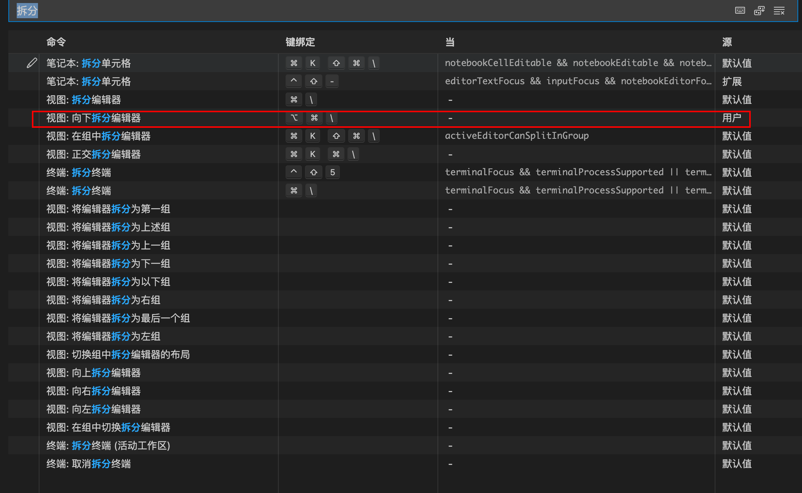

# VsCode快捷键

| 命令     | 快捷键  | 说明 |
| -------- | ------- | ---- |
| 显示终端 | CMD + J |      |
|          |         |      |
|          |         |      |
|          |         |      |
|          |         |      |
|          |         |      |
|          |         |      |
|          |         |      |

### vscode设置向下拆分快捷键的方式

1、 cmd + shfit + p搜索输入：`打开键盘快捷方式`

2、 输入拆分，然后设置快捷键为`opt + cmd + \`

